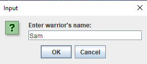
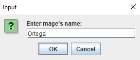
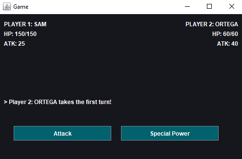
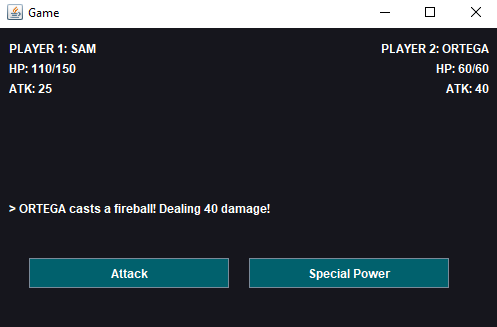
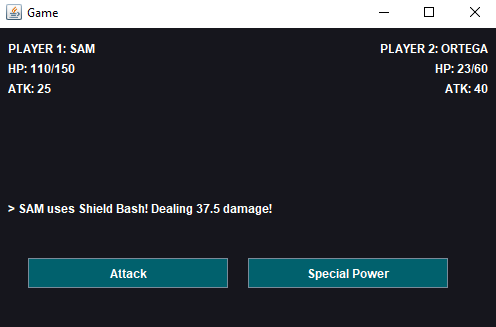
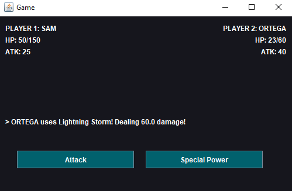
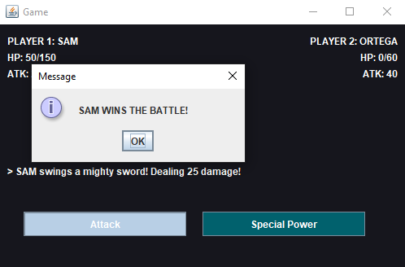

When the program starts running, a pane will immediately ask
for names for the two players.

After which, a GUI will appear with all the neccessary details.
A coin flip will be executed internally, which determines the player to take the first turn.

Pressing any of the two buttons will execute a move according on the instantiated character's method. 
However, it really only returns a text of the move and has no calculations whatsoever. 

Special powers are just normal attack moves except it deals 1.5x the normal damage.

This repeats until one character has a current health of zero. By which a pane will appear declaring a winner.

